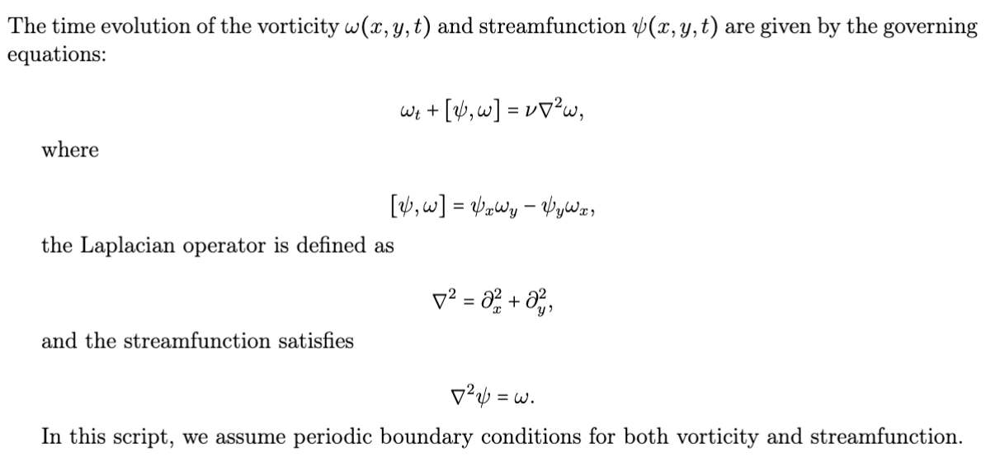
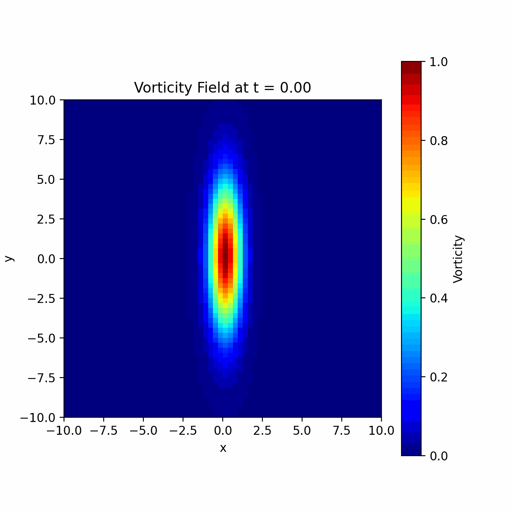
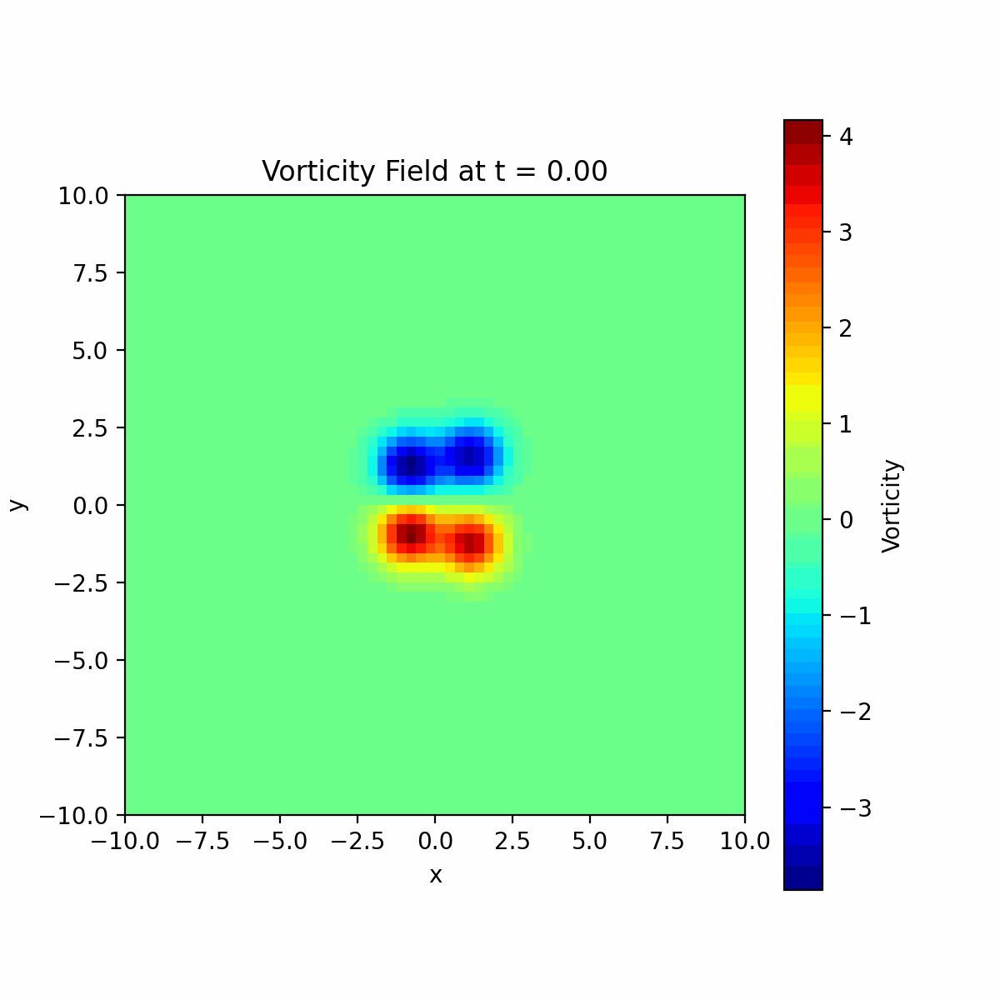

# Vorticity and Streamfunction Simulation

This script simulates the time evolution of vorticity and streamfunction using finite difference methods, spectral methods, and various numerical solvers. The simulation assumes periodic boundary conditions and visualizes the results as an animated GIF.

---

## Governing Equations

The governing equations for the vorticity and streamfunction are shown below:

---

## Key Features

- **Laplacian Operator Construction:** A sparse matrix is used to represent the Laplacian operator for finite difference approximations.
- **Streamfunction Solvers:** The streamfunction is computed using various methods:
  - **Spectral Method using FFT**
  - **Direct Solver**
  - **LU Decomposition**
  - **BiCGSTAB Iterative Solver**
  - **GMRES Iterative Solver**
- **Vorticity Advection and Diffusion:** Solved using the `solve_ivp` integrator with Runge-Kutta methods.
- **Initial Conditions:** Several initial vorticity distributions are provided, including Gaussian, opposite charges, and random configurations.
- **Visualization:** Animated GIF showing the evolution of the vorticity field.

---

## Example GIFs

Below are two examples of vorticity field evolution generated by the script. These visualizations demonstrate the simulation's capability to model different initial conditions and solver methods.

### Example 1: Vorticity Field Evolution Using FFT 
This GIF illustrates the evolution of the vorticity field (Guassian Shaped Initial Condition) over time using the FFT.

---

### Example 2: Vorticity Field With a Different Initial Condition
This GIF shows wwo pairs of opposite-charge vortices colliding .

---